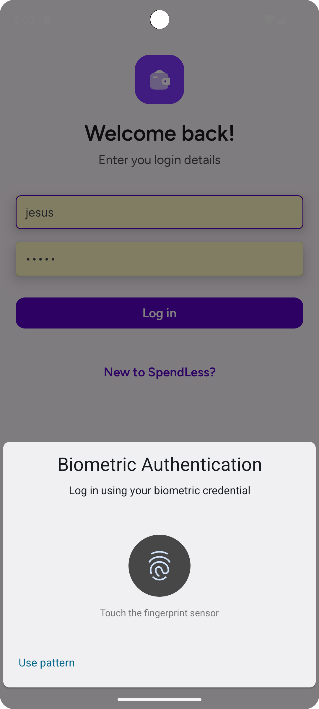
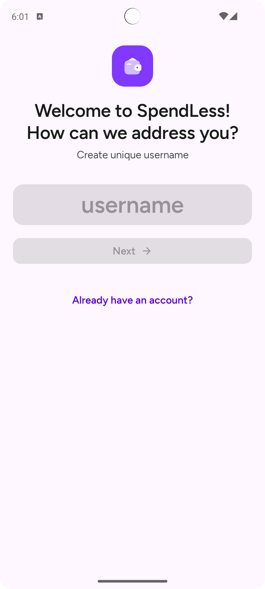
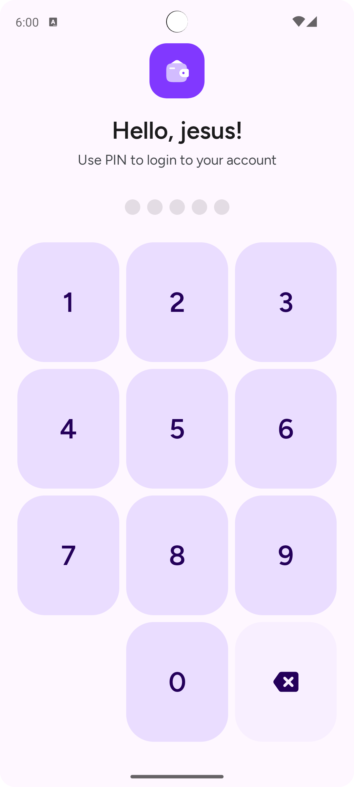
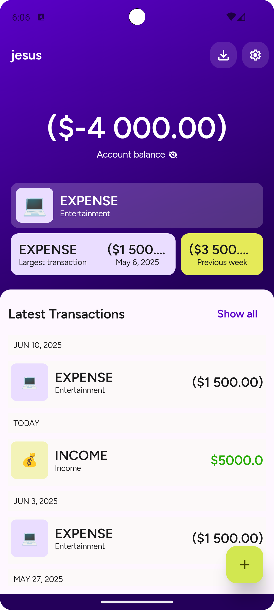
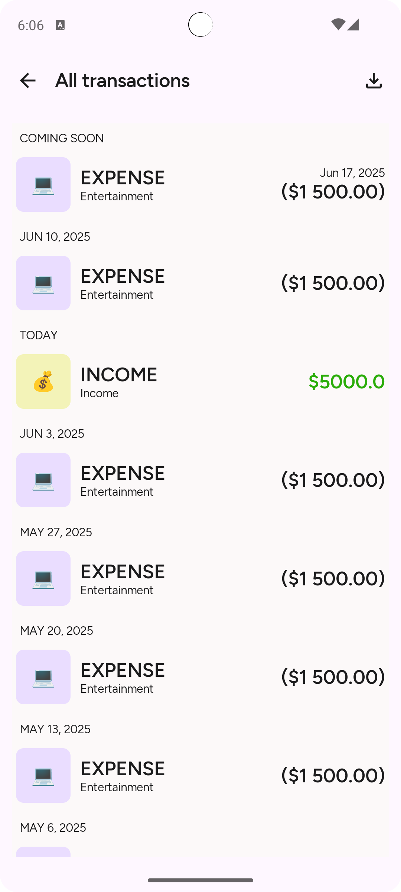
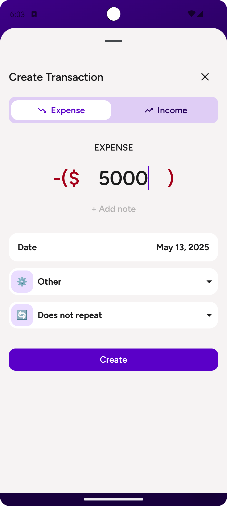
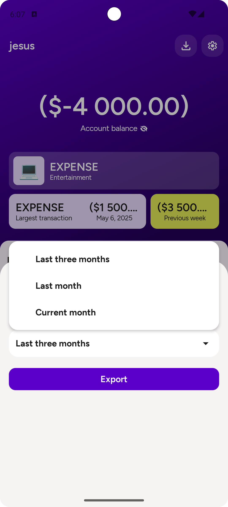
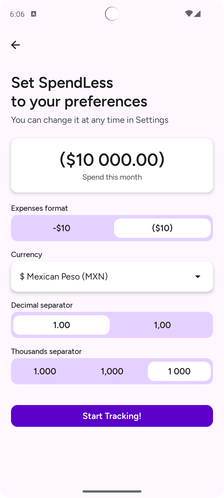
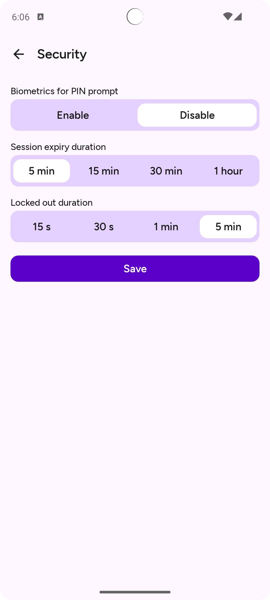
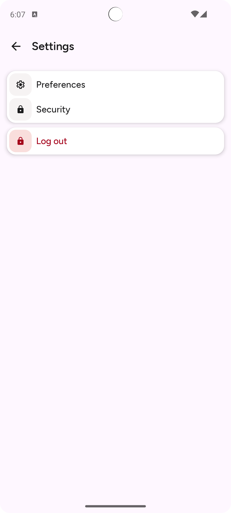

# 💰 SpendLess

**SpendLess** is a personal finance app designed to help you take full control of your income and expenses. With a modern, smooth UI built using Jetpack Compose, SpendLess makes it easy to record, plan, and analyze your financial activity.

---

## ✨ Key Features

- 📊 **Track income and expenses:** Keep a detailed log of all your financial transactions.
- 🗓️ **Schedule future transactions:** Plan ahead by scheduling recurring or one-time transactions.
- 📤 **Export to CSV:** Easily export your transaction history for backup or external analysis.
- 🔒 **Advanced security:**
  - Automatic session lock via idle monitor.
  - Unlock using PIN or biometric authentication (fingerprint or face recognition).
- 📈 **Financial insights:** Get clear summaries and insights into your spending and income habits.
- ⚙️ **Modular and scalable architecture** following industry best practices.

---

## 🛠️ Technologies Used

- **Jetpack Compose:** Modern declarative UI for Android.
- **Clean Architecture:** Clear separation of concerns for scalability and testability.
- **MVI (Model-View-Intent):** Robust state management architecture.
- **Kotlin Coroutines & Flow:** Efficient async and reactive programming.
- **Room:** Local database storage.
- **DataStore:** Modern solution for storing user preferences.
- **Koin / Hilt (whichever applies):** Dependency injection.
- **Material 3:** Consistent design with the latest Android guidelines.

---

## Screenshots

  
  
  
  
  
  
  
  
  
  

